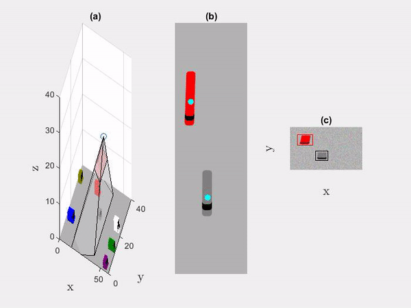

# PT Camera Tracking Simulation 
This project was part of Cornell Course MA4810 final project and presents a 3D simulation of a PT camera model that detects cars and track their speed. It can also detect violation of speed limit given by the user. The projet is implemented in MATLAB and trained with synthetic data. 



The detection is based on YoloV4 implementation in MATLAB and trained on custom data.

The tracker is based on implementation of 2D discrete time second order Kalman Filter.

Hope you will enjoy it :)

## QUICK START

1. Clone the repository
2. run ```main.m``` in matlab

## TRACKER

1. Go to ```main.m``` and update the parameter "tracking" to 1.
2. Run ```main.m```

## TRAIN

1. Go to ```main.m``` and create synthetic data by changing ```data_extract``` to value > 0 and run main.m

This will create a batch of 10 images and will save them in ```data``` folder. The name of the batch will be the same as the ```data_extract``` value, so make sure to change the value to create a new batch without overwriting the old one.

2. Annotate the images in Image Labeler of MATLAB.

To make it easier for you, there is an AutoLabeler function in ```models``` directory that can help you auto-annotate. only make sure that you create the same label names as in this project. 

3. Export the labeled data as ```labeled_data.mat``` to the main directory.
4. Follow the steps in ```models/train.m```.

## SAVE RESULTS

1. Go to ```main.m``` and update the parameter ```vid``` or ```camera_vid``` depends on the results you want to save.

Results will be saved in ```res``` dir.

## TEST FUNCTIONS

### OF_test.m :
Testing the Optical Flow approach on ```camera_footage.avi```
Results will be saved in ```res``` dir.

### yolov4_test.m :
Testing the Yolov4 approach on ```camera_footage.avi```
Results will be saved in ```res``` dir.

### kalman_test.m : 
Testing the kalman filter on a a target moving in circle.

## Disclaimer

The parameters are not fully optimized and this project can be improved drastically.

Same applies to the detection model and the Kalman Filter that has been used.
